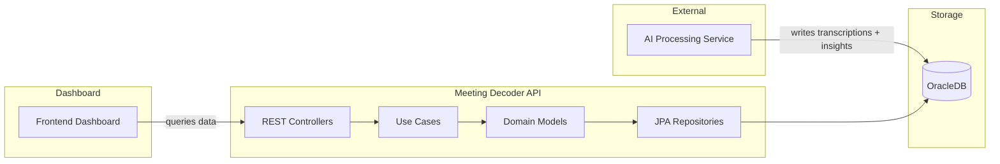

# Meeting Decoder API

REST API for a meeting analytics dashboard. An external AI service processes meeting transcriptions and inserts the results into an OracleDB. This API reads that data and exposes it to the frontend dashboard.

## Architecture



The API follows a **Hexagonal Architecture (Ports & Adapters)** with **Domain-Driven Design**.

```
┌───────────────────────────────────────────────────────┐
│  Infrastructure   │  Application   │    Domain        │
│                   │                │                  │
│  REST Controllers │  Use Cases     │  Entities        │
│  JPA Repositories │  Ports         │  Value Objects   │
│  Config           │  DTOs          │  Repository IFs  │
│                   │                │  Domain Events   │
└───────────────────────────────────────────────────────┘
```

## Bounded Contexts

| Context | Description | Main Entities |
|---|---|---|
| **Transcription** | Meeting recordings and their transcriptions processed by ASR/AI | `Meeting`, `Transcription` |
| **Sales** | Client and seller management with NPS tracking | `Client`, `Seller` |
| **Insights** | AI-extracted insights with sentiment analysis and churn detection | `Insight`, `Produto`, `InsightTag` |

## Tech Stack

| Component | Technology |
|---|---|
| Language | Java 21 |
| Framework | Spring Boot 4.0.6 |
| ORM | Spring Data JPA + Hibernate |
| Database | OracleDB (ojdbc11) |
| Build | Maven (wrapper included) |
| Boilerplate | Lombok |
| Containerization | Docker + Docker Compose |

## Prerequisites

- JDK 21
- Docker + Docker Compose (recommended for the OracleDB)

## Getting Started

### 1. Clone and configure

```bash
cp .env.example .env
```

Edit `.env` with your credentials:

```env
ORACLE_PASSWORD="your_oracle_password"
APP_USER="app_user"
APP_USER_PASSWORD="your_app_user_password"
```

### 2. Run with Docker Compose (recommended)

```bash
docker-compose up
```

This starts:
- **OracleDB** (`gvenzl/oracle-free`) on port `1521`
- **meeting-decoder-api** on port `8080`

> The API waits for the database health check before starting.

### 3. Run locally (development)

Start the OracleDB first, then:

```bash
./mvnw spring-boot:run
```

### 4. Build the JAR

```bash
./mvnw clean package -DskipTests
java -jar target/meeting-decoder-0.0.1-SNAPSHOT.jar
```

## Environment Variables

| Variable            | Description               | Default             |
|---------------------|---------------------------|---------------------|
| `ORACLE_PASSWORD`   | OracleDB system password  | `oracle_password`   |
| `APP_USER`          | Application database user | `app_user`          |
| `APP_USER_PASSWORD` | Application user password | `app_user_password` |

## Project Structure

```
src/main/java/br/com/meetingdecoder/
├── MeetingDecoderApplication.java     # Entry point
├── application/                       # Application layer
│   ├── command/                       # CQRS commands
│   ├── dto/                           # Output DTOs
│   ├── ports/                         # Input port interfaces
│   └── service/                       # Use case implementations
├── domain/                            # Domain layer
│   ├── insight/                       # Insights context
│   ├── sale/                          # Sales context (Client, Seller)
│   ├── transcription/                 # Transcription context
│   └── shared/                        # Shared kernel (validation, exceptions)
└── infraestructure/                   # Infrastructure layer
    └── configuration/                 # Spring @Configuration
```

## Status

The domain model and application use cases are implemented. Infrastructure layer (REST controllers, JPA entities, exception handlers) is under development.
